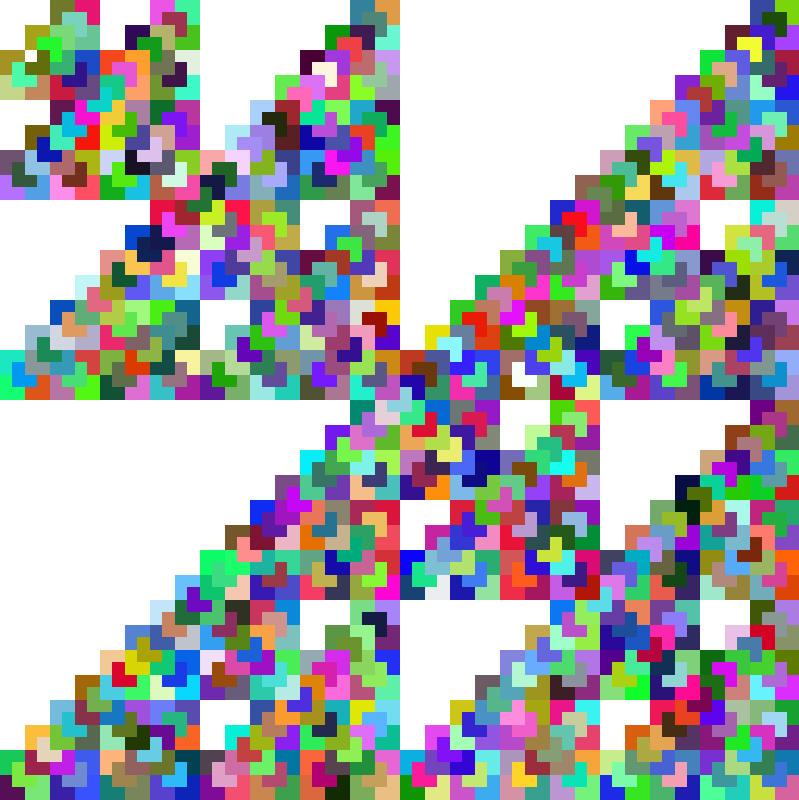
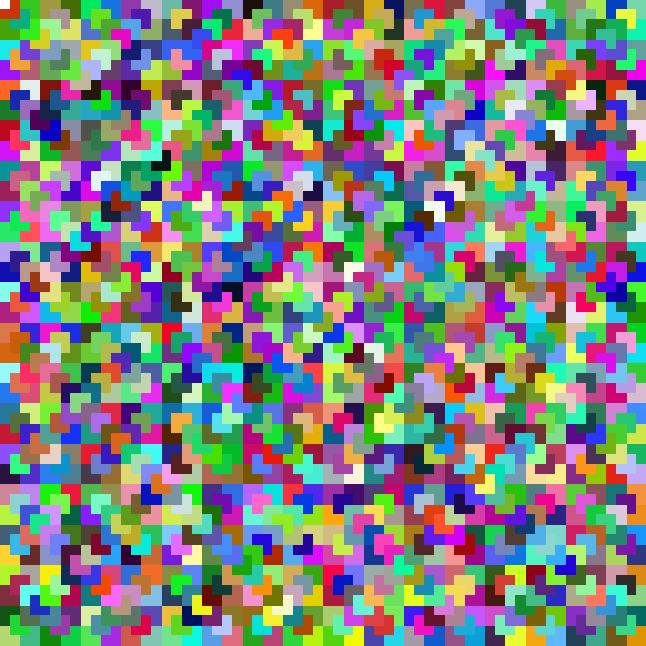

# Tile That Courtyard, Please
[Tile That Courtyard, Please](https://ocw.mit.edu/courses/6-s095-programming-for-the-puzzled-january-iap-2018/4bda18c723c88ca939e5ed0714dabab0_MIT6_S095IAP18_Puzzle_7.pdf)\
Imagine a perfect square courtyard divided into 2^n x 2^n squares. We need to tile the courtyard with L-shaped tiles, each covering exactly 3 squares. The problem is finding a way to tile the entire courtyard without leaving any gaps or overlapping tiles. Another challenge is that one tile is left untiled, which can be at any position in the courtyard.

I used Racket to implement a recursive solution to this problem. I leveraged the divide-and-conquer approach by breaking down the problem into quadrants until reaching the base case. At each recursive step, I divided the courtyard into four quadrants and checked for the position of the untiled square. If the untiled square was in a particular quadrant, I recursively applied the tiling algorithm to that quadrant.
- One of my attempts, courtyardBroken.rkt, resulted in a fractal-like picture. Very cool!
	
- The final attempt, courtyard.rkt, is the working solution.
	
